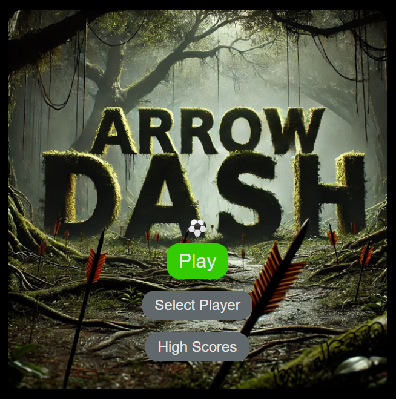
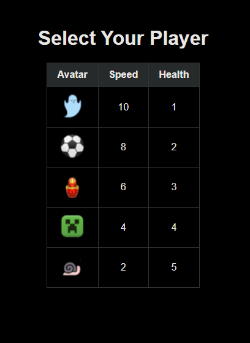
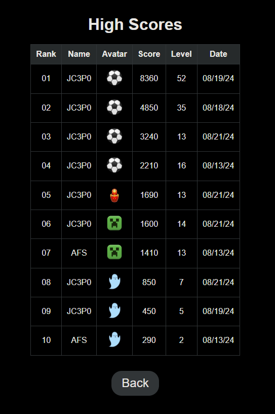
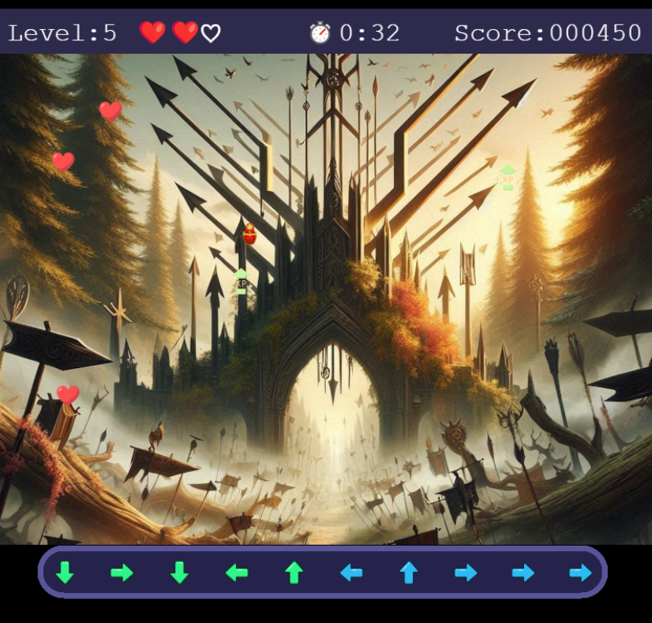
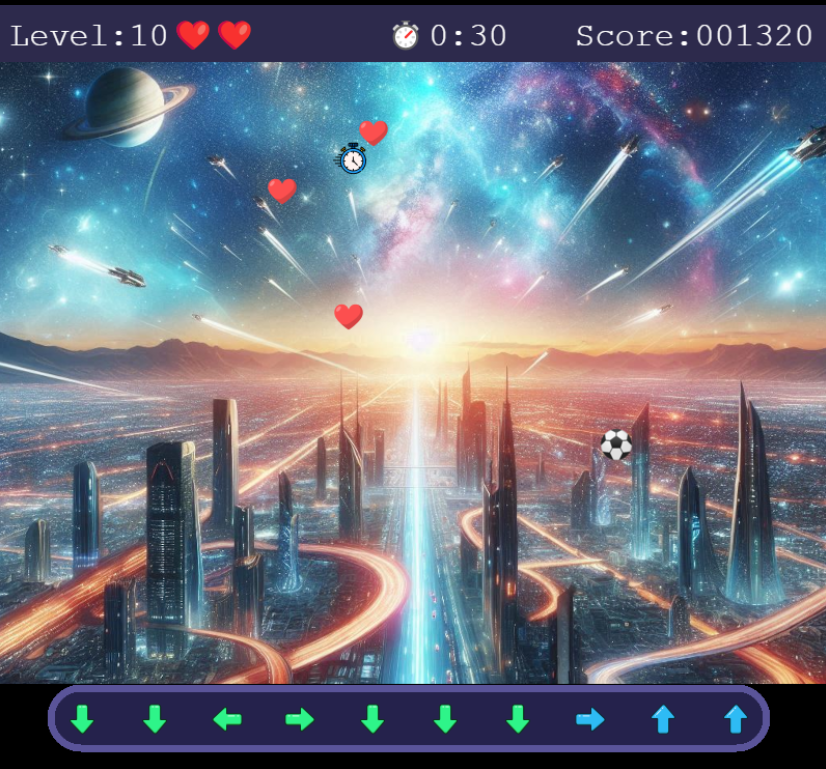

# Arrow Dash

Arrow Dash is an exciting arrow sequence game where the goal is to survive as long as possible while matching randomly generated sequences of 10 arrows (up, down, left, right) per level using your keyboard arrow keys, swipe gestures on mobile and tablet devices, or by clicking and dragging with your mouse. Time your moves to collect as many randomly spawned power-ups as possible! The game ends when either the timer reaches 0 or you lose all of your health. The game dynamically resizes to fit any device, providing a seamless experience whether you're on a desktop, tablet, or smartphone.

## Features

- **Arrow Key Input:** Match the arrow sequences by pressing the corresponding arrow keys.
- **Swipe Input:** Swipe in the direction of the arrow sequence for mobile and tablet users.
- **Mouse Input:** Click and drag in the direction of the arrow sequence on desktop.
- **Power-Ups:** From levels 1-10, health and XP power-ups spawn every 5 seconds. XP power-ups add +50 to your score, and heart power-ups refill an empty health bar or add +100 to your score if health is full. After level 10, timer power-ups also spawn, adding +10 seconds per power-up.
- **Dynamic Sizing:** The game adjusts to fit any screen size.
- **High Score Entry:** Enter a high score with 3-6 characters (letters and numbers only) after completing a game and obtaining a score higher than the top 10.
- **Bad Words Filter:** High score names are filtered using the "bad-words" library to ensure only appropriate names are used. Entering a word on this list will not save a highscore and send you back to the main menu! Please let us know if you believe your name is mistaken for a "bad-word."
- **JWT Validation:** High scores are validated using JSON Web Tokens (JWT).
- **Phaser 3:** Game engine used to build the game along with JavaScript, HTML, and CSS.

## Player Attributes

Each player has unique attributes in terms of speed and health:

| Avatar | Speed | Health |
| ------ | ----- | ------ |
|  | 10 | 1 |
|  | 8 | 2 |
|  | 6 | 3 |
|  | 4 | 4 |
|  | 2 | 5 |

## Screenshots

**Main Menu:**

**Player Selector:**

**High Scores:**

**Levels 1-10:**

**Level 10+:**

**Gameplay:**

## License

This project is licensed under the MIT License - see the [LICENSE](LICENSE) file for details.
